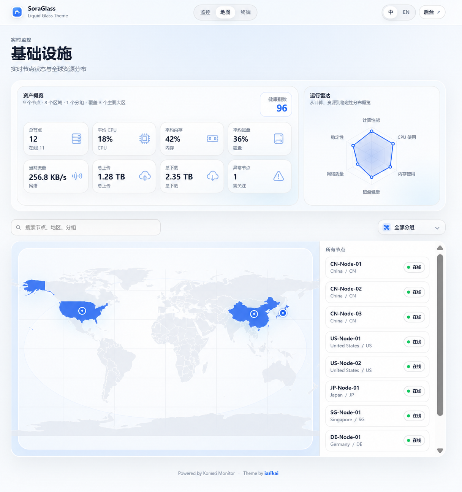
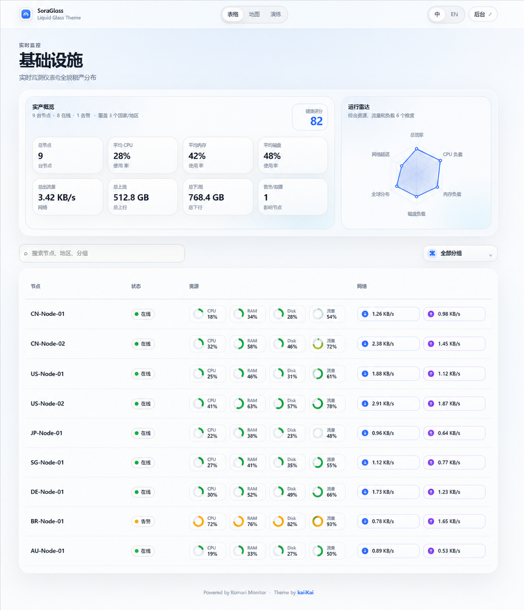
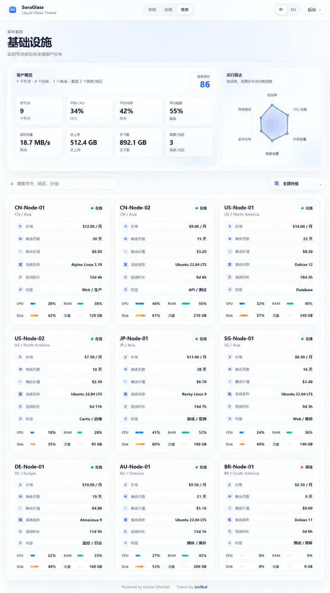
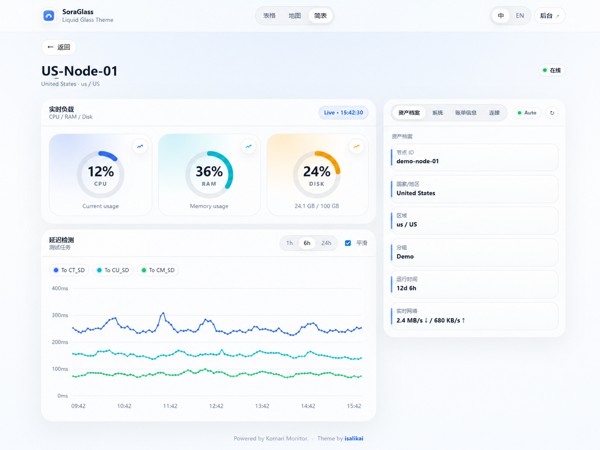

# SoraGlass

SoraGlass 是一款为 Komari Monitor 设计的液态玻璃风格主题。主题以白色、浅蓝、半透明玻璃层、柔和阴影和细线边界为主要视觉语言，目标是在保持轻量的同时，让 Komari 的节点监控、资产信息和历史数据展示更接近现代云平台控制台。

- 主题名称：SoraGlass
- 适用场景：个人服务器监控、节点资产管理、全球节点分布展示、轻量运维面板

---

## 预览图

### 全球地图模式



### 表格模式



### 简表资产卡片



### 节点详情页



---

## 功能特性

### 液态玻璃视觉风格

SoraGlass 使用半透明玻璃面板、柔和蓝色高光、圆角容器、细线边界和轻量阴影，整体偏向干净、明亮、克制的现代仪表盘风格。

### 多种节点展示模式

主题提供三种节点查看方式：

1. **表格模式**：适合快速查看节点实时状态。CPU、内存、硬盘、剩余流量使用小圆圈状态展示，网络上下行使用独立方向胶囊展示。
2. **地图模式**：根据节点国家或地区进行全球资产分布展示。有服务器的国家会高亮，并在地图上显示聚合点。鼠标悬停可查看该国家服务器数量和节点名称。
3. **简表模式**：更偏资产摘要卡片，展示价格、剩余天数、剩余价值、系统名称、在线时长、标签以及资源条形状态。

### 节点详情页

详情页保留实时负载圆圈和延迟检测图，同时右侧使用切换卡片展示：

- 资产档案
- 系统信息
- 账单信息
- 连接信息

右侧信息卡片支持自动轮播，也可以手动点击切换。

### 实时负载与历史数据

CPU、RAM、Disk 三个实时圆圈会随着实时数据平滑变化。点击圆圈右上角的小图标或圆圈卡片，可以打开历史数据弹窗，查看对应指标的折线图。

历史弹窗支持：

- 1h
- 6h
- 24h
- 平滑曲线开关
- 鼠标悬停查看具体时间点数据

### 延迟检测图

节点详情页支持展示 Komari 的延迟检测历史数据。多个延迟检测任务会显示在同一张图中，并可按任务名称显示或隐藏。

### 离线节点处理

在线节点优先显示，离线节点自动排到列表底部。离线节点会降低透明度，并带有斜线失活效果，方便快速识别。

---

## 安装方式

* 方案1：

1. 下载主题压缩包 `SoraGlass-v1.0.0.zip`。
2. 进入 Komari 后台管理页面。
3. 打开主题管理页面。
4. 上传主题压缩包。
5. 选择并启用 `SoraGlass`。
6. 根据需要进入主题设置调整标题、语言、默认视图、强调色等配置。

* 方案2：

1. 通过后台在线方式导入主题安装`https://github.com/isalikai/Komari-Monitor-Theme-SoraGlass.git`

---

## 主题配置

SoraGlass 支持 Komari 的动态主题配置。主题设置名称为：

```text
SoraGlass Settings
```

可配置项包括：

| 配置项 | 说明 |
|---|---|
| Language / 语言 | 设置前台语言，可选择自动、中文或英文 |
| 首页标题（中文） | 中文界面的首页主标题 |
| 首页副标题（中文） | 中文界面的首页副标题 |
| Home title (English) | 英文界面的首页主标题 |
| Home subtitle (English) | 英文界面的首页副标题 |
| Default View / 默认视图 | 默认进入表格、地图或简表模式 |
| Default Ping Range / 默认延迟范围 | 默认延迟图时间范围 |
| Smooth Charts by Default / 默认平滑图表 | 是否默认使用平滑折线 |
| Accent Color / 强调色 | 主题强调色 |
| Show Billing / 显示账单 | 是否显示账单信息 |
| Show Footer / 显示页脚 | 是否显示页脚信息 |

---

## 雷达图数据说明

首页右侧的运行雷达图用于快速观察整体节点健康状态。雷达图不是直接来自单个接口字段，而是根据当前节点实时数据计算得到。

雷达图包含 6 个维度：

### 1. 在线率

```text
在线率 = 在线节点数量 / 总节点数量 × 100
```

如果总共有 10 台机器，其中 8 台在线，则在线率为 80。

### 2. CPU 余量

```text
CPU 余量 = 100 - 平均 CPU 使用率
```

例如平均 CPU 为 35%，则 CPU 余量为 65。

### 3. 内存余量

```text
内存余量 = 100 - 平均内存使用率
```

例如平均内存为 60%，则内存余量为 40。

### 4. 硬盘余量

```text
硬盘余量 = 100 - 平均硬盘使用率
```

例如平均硬盘为 70%，则硬盘余量为 30。

### 5. 全球分布

```text
全球分布 = min(100, 国家或地区数量 × 18)
```

这个指标用于表达节点分布的丰富度。节点分布国家越多，该值越高，最高为 100。

### 6. 网络活跃度

```text
网络活跃度 = min(100, log10(实时总流量 + 1) × 14)
```

该指标用于表达当前节点网络活动强度。由于网络速度数值波动范围很大，所以使用对数缩放，避免高流量节点把图表拉得过满。

### 健康指数

首页的健康指数综合使用以下权重计算：

```text
健康指数 = 在线率 × 0.38
       + CPU 余量 × 0.17
       + 内存余量 × 0.17
       + 硬盘余量 × 0.14
       + 全球分布 × 0.07
       + 网络活跃度 × 0.07
```

健康指数越高，说明当前节点整体状态越稳定。

---

## 剩余价值计算说明

简表页面会显示服务器的价格、剩余天数和剩余价值。剩余价值是一个估算值，用来快速判断当前服务器资产还有多少未使用价值。

### 基础公式

```text
剩余价值 = 价格 ÷ 周期天数 × 剩余天数
```

例如：

```text
价格：30 元
周期：月付，按 30 天计算
剩余天数：4 天

剩余价值 = 30 ÷ 30 × 4 = 4 元
```

### 年付示例

```text
价格：999 元
周期：年付，按 365 天计算
剩余天数：339 天

剩余价值 = 999 ÷ 365 × 339 ≈ 927.66 元
```

```text
价格：179.1 元
周期：年付，按 365 天计算
剩余天数：77 天

剩余价值 = 179.1 ÷ 365 × 77 ≈ 37.79 元
```

### 多年剩余时间

如果服务器是年付，并且因为续费等原因剩余时间超过 365 天，仍然按年付周期计算：

```text
价格：99 元 / 年
剩余天数：555 天

剩余价值 = 99 ÷ 365 × 555 ≈ 150.53 元
```

这个值可以超过单年价格，因为它表示当前剩余天数对应的未使用价值。

### 特殊价格规则

| 价格值 | 显示结果 |
|---|---|
| `-1` | 免费 |
| `0` | 未设置 |
| 长期 / lifetime / permanent | 长期 |
| 无价格或无到期日 | 不计算剩余价值 |

### 周期天数规则

| 周期 | 计算天数 |
|---|---:|
| 日付 | 1 天 |
| 周付 | 7 天 |
| 月付 | 30 天 |
| 季付 | 90 天 |
| 半年付 | 182 天 |
| 年付 | 365 天 |

---

## 账单日显示规则

账单日会被格式化为日期，不显示具体时间。

例如：

```text
2027-12-04T00:00:00Z
```

会显示为：

```text
2027/12/04
剩余 555 天
```

特殊规则：

| 原始值 | 显示结果 |
|---|---|
| `0001-01-01T00:00:00Z` | 未设置 |
| 超远未来日期 | 长期 |
| 已过期日期 | 已过期 |

---

## 地图显示说明

地图模式会根据节点名称、地区、分组、标签等字段尽量识别节点所属国家或地区。

特别处理：

- 台湾合并到中国统计
- 海南合并到中国统计
- 香港合并到中国统计
- 澳门合并到中国统计

地图显示逻辑：

- 有服务器的国家区域高亮
- 国家中心显示服务器数量聚合点
- 鼠标悬停显示该国家服务器数量、在线数量和服务器名称

---

## 目录结构

```text
SoraGlass-v1.0.0.zip
├── komari-theme.json
├── preview.png
└── dist
    ├── index.html
    └── assets
        ├── icon.svg
        ├── style.css / style.v*.css
        ├── app.js / app.v*.js
        └── world.geo.json
```

---

## 说明

SoraGlass 主要面向轻量、优雅、可读性强的服务器监控场景。主题不会追求过度复杂的大屏效果，而是尽量让节点状态、资产信息、地图分布和历史趋势都保持清晰、克制、耐看。
